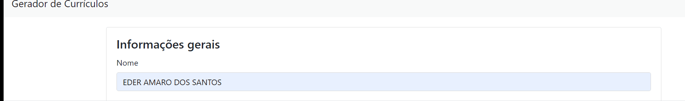

# Gerador de currículos em PHP

## Estrutura de pastas

- **css:** Arquivos CSS (folhas de estilo que formatam cada um dos modelos de currículo);
- **img:** Arquivos de imagem (ícones que aparecem nos currículos);
- **js:** Contém o arquivo JavaScript:
    - **index.js:** Arquivo JavaScript responsável por adicionar e remover formações e experiências dinamicamente (código comentado);
- **modelos:** Arquivos PHP que representam os 3 modelos de currículo disponíveis;
    - **modelo1.php:** Modelo moderno preto;
    - **modelo2.php:** Modelo moderno azul;
    - **modelo3.php:** Modelo básico;
- **gerarCurriculo.php:** Arquivo PHP que recebe os dados do formulário e imprime no modelo de currículo selecionado (código comentado);
- **index.php:** Arquivo inicial da aplicação, que contém o formulário para preenchimento dos dados.

## Tecnologias utilizadas

- HTML;
- CSS;
- JavaScript;
- jQuery;
- Bootstrap;
- PHP.

### Obesevações 
- Este aplicativo gerador de currículo é voltado para desenvolvedores web em geral pois há um campo tecnologias que o usuario domina ou esta aprendendo por exemplo no meu caso são HTML5 , CSS3 , JavaScript , PHP , linguagem C e outros.

O ususario pode opitar por um tipo de currículo ao terminar de adicionar os dados no campo de formulario do gerador de currículo dois modelos com a foto o azul e o preto e um mais basico sem foto .

Tem a opção de baixar ou imprimir o currículo também.

Fiz o calculo da idade pelo PHP não consegui fazer pelo Javascript.

This section has moved here: 

echo "# APO-gerador-curriculo" >> README.md

### Como funciona esta aplicação

É só ir inserindo os dados nos campos em destaque como 
nome , data de nascimento , cargo pretendido , anexar foto , endereço , telefone , email , resumo , tecnologias , e dinamicamente inserido os dados formação e experiência.

Depois escolher o modelo de curriculo a escolha envolve um button radio que só deixar escolher uma opção que pode ser o modelo preto , modelo azul e o modelo basico sem a foto.

Apos escolher o modelo de curriculo clicar em Gerar curriculo que vai abrir outra tela e vai dar a opção de imprimir ou antes tem a opção de Limpar campos clicando nessa botão vai apagar todos os campos e será necessario preenche-los novamente.

